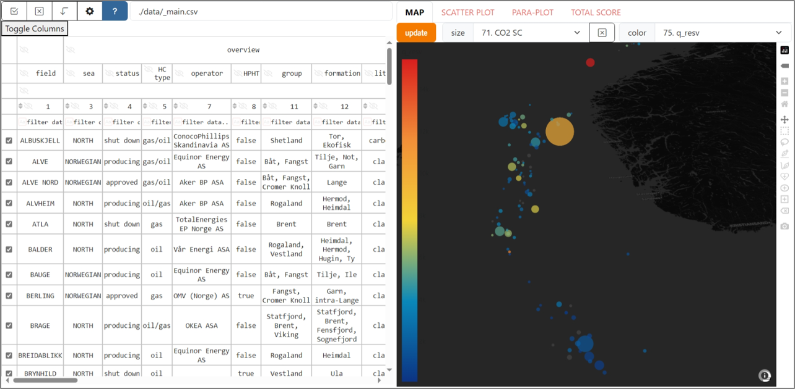

# SubCSeT 
### (Screening Tools for SUBsurface CO2 storage in petroleum reservoirs on the NCS)  

The repository contains codes, tools, and data for screening CO2 storage potential of petroleum reservoirs on the Norwegian Continental Shelf (NCS) developed in [WP6 of the CSSR](https://cssr.no/research/fa3/wp-6/), namely:
1.  an open database [*data/_main.csv*](https://github.com/cssr-tools/SubCSeT/blob/main/data/_main.csv) of 134 fields on the NCS compiled from:
    * [FactPages of the Norwegian Offshore Directorate](https://factpages.sodir.no/)  
    * [Public portal of DISKOS database](https://www.diskos.com/) 
    * more references are to be found in the main.ipynb  
2. [*main.ipynb*](https://github.com/cssr-tools/SubCSeT/blob/main/main.ipynb) details the data retrieval, processing, and feature engineering workflows  
3. **web app** to visualize the data and perform screening deployed at **https://subcset-35e143428f88.herokuapp.com/**  
  

## Requirements
The **requirements** are listed in *requirements.txt* (for **pip**) and *requirements.yml* (for **conda**). The environment can be reproduced by:  
`pip install requirements.txt`  
or `conda env create -n [*env. name*] --file requirements.yml` 

NB! For Anaconda users. As Anaconda has recently updated its terms of service (read [HERE](https://www.anaconda.com/blog/is-conda-free) and [HERE](https://www.anaconda.com/pricing/terms-of-service-faqs)), please check if you can use the `default` channel. Remove it from the yml-file if necessary.
